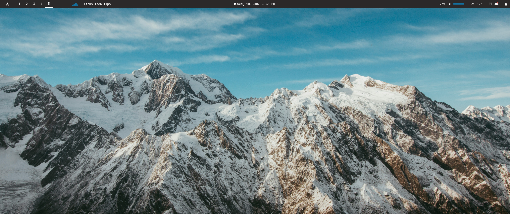
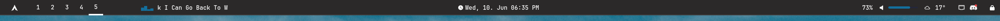
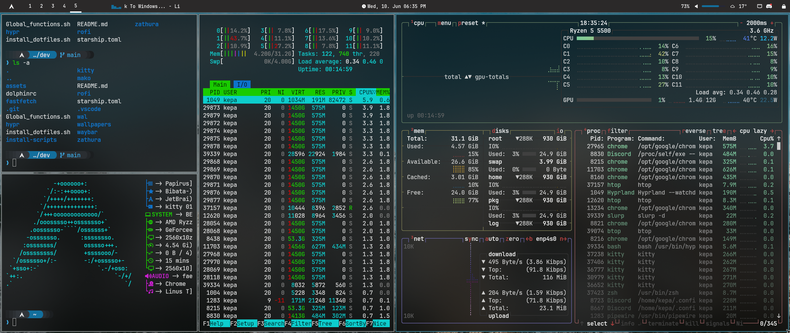

# 🍚 Meus Dotfiles para Arch Linux com Hyprland

Este repositório contém minhas configurações pessoais (dotfiles) para um ambiente de desktop Arch Linux, utilizando [Hyprland](https://hyprland.org/) como compositor Wayland. O objetivo é criar um ambiente de desenvolvimento produtivo, visualmente agradável e altamente customizável.







---

## ✨ Destaques

-   **Compositor Wayland:** [Hyprland](https://hyprland.org/) com animações fluidas e configuração modular.
-   **Barra de Status:** [Waybar](https://github.com/Alexays/Waybar) customizada com módulos úteis.
-   **Launcher de Aplicativos:** [Rofi](https://github.com/davatorium/rofi) para um acesso rápido e eficiente.
-   **Terminal:** [Kitty](https://sw.kovidgoyal.net/kitty/) com aceleração por GPU e alta performance.
-   **Editor de Código:** Configuração moderna para [Neovim](https://neovim.io/) em Lua, com LSP, autocompletar e muito mais.
-   **Notificações:** [Mako](https://github.com/emersion/mako) para notificações leves e customizáveis.
-   **Tematização:** Gerenciamento de cores com [pywal](https://github.com/dylanaraps/pywal), integrado com Hyprland, Rofi e outros.
-   **Shell:** [Zsh](https://www.zsh.org/) com [Oh My Zsh](https://ohmyz.sh/) e um prompt elegante com [Starship](https://starship.rs/).

---

## 🔧 Instalação

1.  **Clone o repositório:**

    ```bash
    git clone https://github.com/joaquimsnjunior/dev.git ~/dev
    cd ~/dev
    ```

2.  **Execute o script de instalação de dotfiles:**

    O script `install_dotfiles.sh` criará links simbólicos das configurações deste repositório para os locais corretos no seu sistema (como `~/.config`).

    ```bash
    ./install_dotfiles.sh
    ```

3.  **Scripts Adicionais (Opcional):**

    A pasta `install-scripts/` contém scripts para configurar partes específicas do sistema:

    -   `zsh.sh`: Instala o Zsh, define-o como shell padrão e instala o Oh My Zsh.
    -   `nvidia.sh`: Configura os drivers da NVIDIA e os módulos necessários para o Hyprland.
    -   `emoji.sh`: Instala o suporte a emojis.

    Execute o script que for relevante para o seu sistema. Por exemplo:

    ```bash
    ./install-scripts/nvidia.sh
    ```

---

## ⌨️ Neovim

A configuração do Neovim está localizada em `nvim/`. Ela é baseada em Lua e utiliza o `lazy.nvim` para gerenciamento de plugins.

Para uma lista completa de atalhos de teclado, consulte o arquivo [KEYBINDS.md](KEYBINDS.md).

---

## 📂 Estrutura do Repositório

```
.
├── hypr/             # Configurações do Hyprland, Hyprlock, Hyprpaper
├── install-scripts/  # Scripts para instalação de drivers e pacotes
├── kitty/            # Configuração do terminal Kitty
├── mako/             # Configuração do daemon de notificações Mako
├── rofi/             # Configuração e temas do Rofi
├── wal/              # Templates do Pywal para tematização dinâmica
├── waybar/           # Configuração e estilos da Waybar
├── wallpapers/       # Meus papéis de parede
├── install_dotfiles.sh # Script principal para criar os symlinks
└── README.md         # Você está aqui :)
```

---

Sinta-se à vontade para usar, modificar e adaptar estes dotfiles para o seu próprio fluxo de trabalho!
